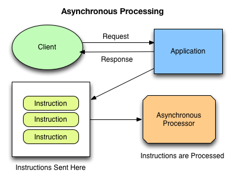

Discussions
===========

Interface for complex tasks Django ecosystem
--------------------------------------------
Managing and maintaining a Django-based application involves executing complex tasks such as, for example,
Extract, Transform, and Load (ETL) operations, cleanup operations, indexing, ....
While these tasks are fundamental for data management/warehousing,
their manual execution can be laborious and prone to errors.

Providing a dedicated interface for such operations not only streamlines the process
but also enhances efficiency and reduces potential mistakes that can arise from manual intervention.

An automated, seamless and robust system is thus crucial in handling such operations.
This offers benefits in terms of task efficiency, reduction of manual intervention,
and elimination of potential errors that can arise from manual process steps.

Integration into Django admin site
----------------------------------

Equally crucial is the requirement for the said interface to be integrated within the native Django admin site.
The rationale behind this is to bring about ease of use and accessibility particularly
to non-technical personnel who need to interact with the system.

The Django admin site provides an out-of-the-box, user-friendly GUI that simplifies the management tasks.
Therefore, integrating the custom interface into the Django admin site will offer
non-technical users a familiar and intuitive environment to execute complex tasks without
the need to write or understand code.

Use of a Queue Manager
----------------------

A key component in managing and executing complex tasks is the use of a job or task queue manager.
In the context of Python and Django, robust queue managers namely RQ (Redis Queue) and Celery
stand out as the most popular options. These tools facilitate the management and processing of asynchronous
tasks which are queued and executed based on priority, scheduled time, or other custom logic.

The need for such a setup arises from the inherent complexity of managing multiple long-running tasks,
each possibly varying in computational requirements. Without a queue manager, the system risks running into
resource allocation issues, redundancy, and failure in task execution.
In contrast, utilizing a queue manager provides control over resource allocation,
task prioritization and consequently, a more efficient and reliable system.
Choosing between RQ and Celery will depend on specific application requirements,
although either will contribute significantly to streamline task management.

In conclusion, integrating an interface for complex operations into the Django admin site,
and utilizing a reliable queue manager, are essential steps towards efficient and reliable
Django application management, particularly for non-technical users.