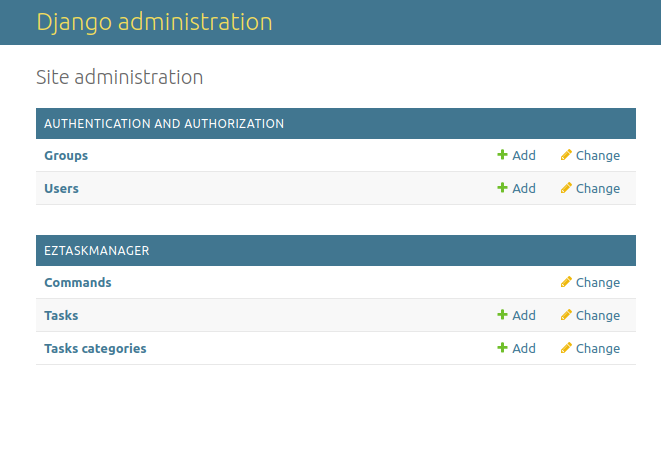
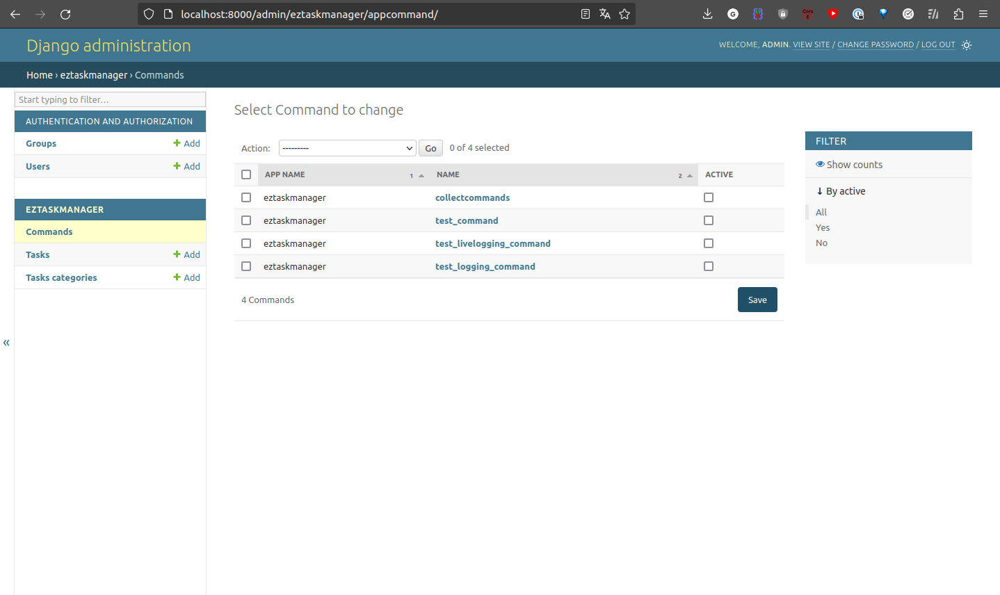
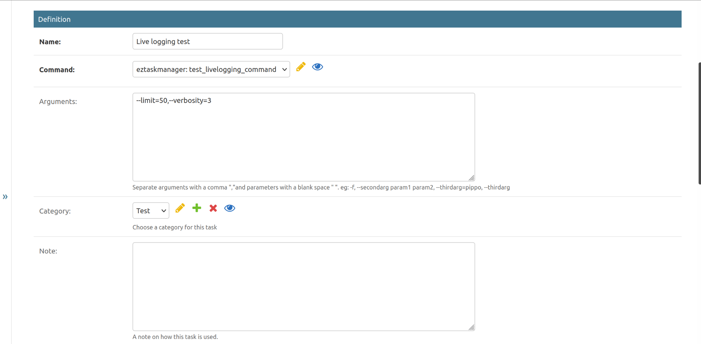
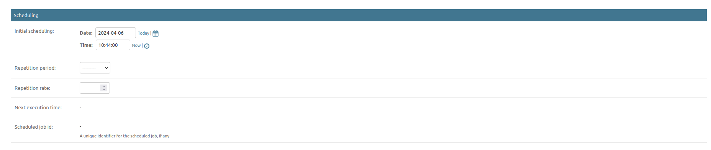
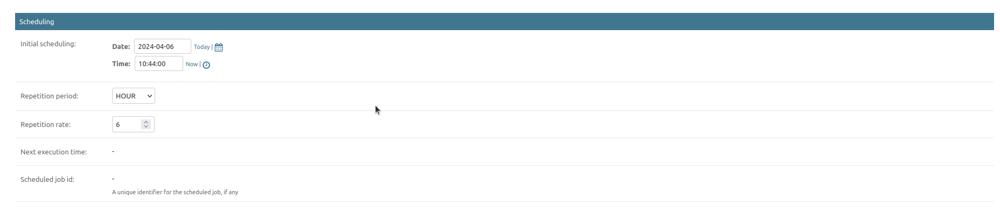
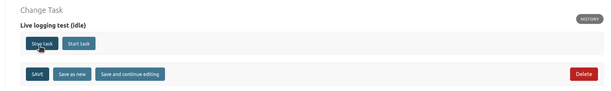

Get started
============

Following the demo tutorial, it will be possible to install, configure and use **eztaskmanager** for a
simple demo django project running in developer mode, working with Redis Queue.

Further knowledge, with detailed admin description, use in production deployments,
enabling existing notifications plugins or developing a custom one,
can be found in the :ref:`howto-guides`.

The demo tutorial (RQ)
----------------------

Clone the project from github onto your hard disk:

.. code-block:: bash

    git clone https://github.com/openpolis/django-eztaskmanager
    cd django-eztaskmanager

There is a basic Django project under the ``demoproject`` directory, set to use ``eztaskmanager``.

.. code-block::

    demoproject/
    ├── demoproject/
    │   ├── __init__.py
    │   └── asgi.py
    │   ├── settings.py
    │   ├── test_settings.py
    │   ├── urls.py
    │   └── wsgi.py
    ├── manage.py
    ├── static/
    └── docker-compose-local.yml

Installation and setup
^^^^^^^^^^^^^^^^^^^^^^

As a **pre-requisite**, a Redis server should be up and running on the default port 6379.
Follow the instructions_, or if you use docker_, just run ``docker compose -f docker-compose-local.yml``.

Enter the ``demoproject`` directory, then create and activate the virtual environments:

.. code-block:: bash

    $ cd demoproject
    $ mkdir -p venv
    $ python3 -m venv venv
    $ source venv/bin/activate

Install **eztaskmanager**, this will install all needed dependencies (django, redis, django-rq, rq-scheduler,...):

.. code-block:: bash

    (venv) $ pip install django-eztaskmanager

Then execute this commands to setup the server in development mode, the rq worker and the scheduler:

.. code-block:: bash

    (venv) $ python manage.py migrate  # create tables in the DB (default sqlite will do)
    (venv) $ python manage.py createsuperuser # take note of username and password for login
    (venv) $ python manage.py collectcommands --excludecore  # collect basic commands from the eztaskmanager package
    (venv) $ python manage.py runserver  # django app server on port 8000
    (venv) $ python manage.py rqworker  # rq worker to execute enqueued tasks
    (venv) $ python manage.py rqscheduler --verbosity=3  # rq scheduler to enqueue periodic tasks

.. _instructions: https://redis.io/docs/install/install-redis/
.. _docker: https://www.docker.com/

Usage
^^^^^

Visit http://127.0.0.1:8000/admin/ and login with the credentials set in the ``createsuperuser`` task.
a new **EZTASKMANAGER** section appears.

3 administration sections are available:

- **Commands**: to see and select which commands are available for tasks creation.
- **Tasks**: to manage tasks, usual CRUD operations, and start and stop
- **Task categories**: to manage task groups

Create and Launch a Task
+++++++++++++++++++++++++++++++++++++++++

A task is an invoked management command with specific arguments.

You have already launched and imported commands using
``python manage.py collectcommands --excludecore`` during the setup phase.

Navigate to the Commands section of the admin interface; here, you will find a list of commands from all your Django
applications. In this demo project, only commands within **eztaskmanager** will be available.

Ensure to activate the following commands, as only **active** commands will be available for task creation:

- **test_livelogging_command**
- **collectcommands**

Now, in the Tasks section, click the **Add task** button in the top-right corner.

Provide a name, select the desired command, and enter the arguments as: ``--limit=200,--verbosity=3``.
Leave all other fields untouched.

Click **Save and continue editing**, and then **Start**.

This will enqueue the task, and it will be executed immediately within the queue manager context (RQ worker).

.. note::

    Django management commands usually extend the :py:class:`django.core.management.base.BaseCommand` and
    log to the STDERR stream. As such, log messages can be seen in the RQ worker logs.

    To have log messages stored within the database for future inspection or live viewing,
    the management command must extend :py:class:`eztaskmanager.services.logger.LoggerEnabledCommand`.

Monitor Task Execution in Live-viewer Window
+++++++++++++++++++++++++++++++++++++++++++++++++

Setting the ``limit`` task option to 200 provides ample time for observation of log messages in the live viewer.

Upon pressing the **Start** button, the task status next to its title will shift to *Started*.

Scroll down to the *Launch Reports* section where a new report will be generated. Click "Show the log messages,"
which will open a new tab in your browser where log messages will appear as they are generated by the executing task.

Schedule a Task for Future Execution
++++++++++++++++++++++++++++++++++++++

To **schedule** a task to start at a specific time, set the **Scheduling** fields accordingly:

Execute Periodic Tasks
+++++++++++++++++++++++++++++++++++

To execute a task **repeatedly**, schedule both fields for a future date and set the **Repetition rate** and
**Repetition period** to desired values:

.. note::

    In order to confirm task execution, observe the following (refresh the page as necessary):

    - The **Last datetime** and **Next** read-only fields update over time.
    - New reports are generated and shown in the Reports section (only the latest five are retained).
    - The RQ worker console displays a stream of messages corresponding with the ``verbosity`` arguments.

Terminate Future Task Executions
++++++++++++++++++++++++++++++++++++

To stop a future scheduled task, click the **Stop task** button and verify that executions cease.

.. rubric:: Footnotes
.. [#excludecore] `excludecore` avoids fetching core Django tasks.